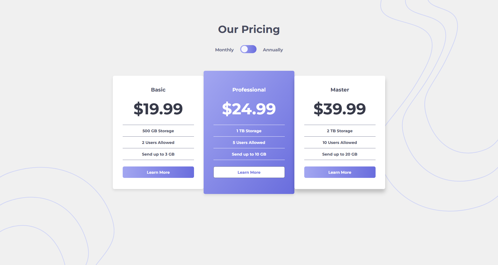

# 💸 Pricing Component with Toggle

A modern, responsive pricing component that allows users to toggle between monthly and annual billing. Built with **HTML**, **CSS**, and **JavaScript**, this project demonstrates dynamic UI updates, persistent user preferences, and clean, accessible design.

---

## ✨ Features

- **Billing Toggle:** Switch between monthly and annual pricing with a smooth toggle switch.
- **Persistent Preference:** Remembers the user's last billing choice using `localStorage`.
- **Responsive Design:** Looks great on all devices, from desktop to mobile.
- **Accessible Markup:** Semantic HTML and proper label associations.
- **Animated UI:** Subtle transitions for toggle and card hover effects.

---

## 🚀 Demo



> **Live Preview:** _Coming Soon!_

To run locally:

```bash
git clone https://github.com/abhi-zero/dev-journey.git
cd dev-journey/mini-projects/pricing-component-with-toggle
open index.html # Or use VS Code Live Server
```

---

## 🛠️ Tech Stack

- **HTML5** – Semantic structure
- **CSS3** – Custom properties, gradients, responsive layouts
- **JavaScript (ES6)** – DOM manipulation, event handling, localStorage

---

## 📁 Project Structure

```
pricing-component-with-toggle/
├── index.html              # Main HTML file
├── style/
│   └── style.css           # Styles and responsive rules
├── script/
│   └── script.js           # Pricing toggle logic
├── images/
│   └── favicon-32x32.png   # Favicon
└── README.md               # ← This file
```

---

## 🔍 How It Works

- **Data:** Pricing values for monthly and annual plans are stored in a JavaScript object.
- **Toggle:** The checkbox input toggles between billing cycles. The UI updates prices and saves the preference.
- **Persistence:** On page load, the script checks `localStorage` for the user's last choice and applies it.
- **Accessibility:** The toggle is keyboard-accessible and uses a `<label>` for better usability.

---

## 💡 Customization

- **Add/Change Plans:** Edit the `prices` object and update the HTML for more plans.
- **Change Colors/Fonts:** Modify CSS variables in `style.css`.
- **Adjust Animations:** Tweak transition durations and effects in the CSS.

---

## 🗜️ What I Learned

- Managing state and persistence with `localStorage`.
- Creating accessible, interactive UI components.
- Responsive design with CSS custom properties and media queries.
- Clean separation of structure, style, and behavior.

---

## 🖼️ Inspiration

This project was inspired by the [Frontend Mentor Pricing Component with Toggle Challenge](https://www.frontendmentor.io/challenges/pricing-component-with-toggle-8vPwRMIC).  
The starter content, style details (fonts, colors), and basic layout were provided by the challenge. Credit to Frontend Mentor for the original concept and design inspiration.

---

## 📜 License

MIT © 2025 Abhinandan